<div align="center">
  

  # Wisprnote

  **An AI operating system for your working memory.**

  Wisprnote runs on your Mac, listens to every word spoken in your meetings, turns them
  into a searchable knowledge base, and connects that knowledge to the tools you already
  work in — so everything your team knows lives in one place instead of scattered across
  a dozen apps.

  [](https://github.com/migavel508/wisprnote-AI/releases/latest)

  [](LICENSE)
  [](LICENSING.md)
  [](https://tauri.app)
  [](mcp-server/)

  [Download](https://github.com/migavel508/wisprnote-AI/releases/latest) • [Demo](#demo) • [What it does](#what-it-does) • [Install](docs/INSTALL.md) • [Architecture](#architecture) • [Licence](#licence)
</div>

---

## Demo

The whole four-minute walkthrough, cut into eleven loops — one per part of the product, in
the order the demo shows them. Each one plays silently in place on this page.

**[▶ Play the full demo](docs/demo/wisprnote-demo.mp4)** — MP4 (H.264/AAC) • 1920×1080 •
4:00 • 26 MB • [static poster frame](docs/demo/demo-poster.jpg)

### 1 · Home — 0:00

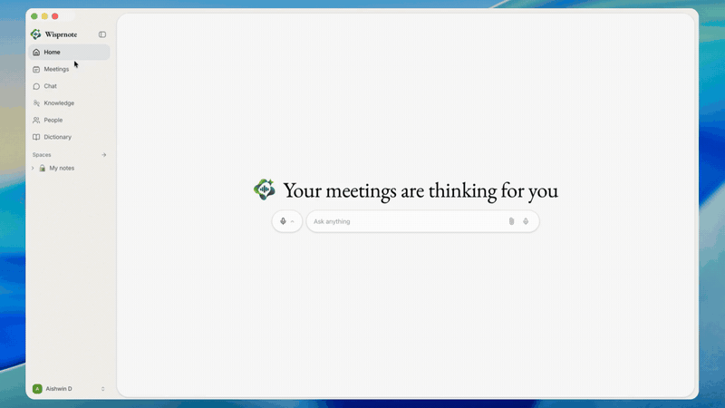

One question box, not a menu. The prompt chips suggest what to try, and the meetings list is
a click away.

### 2 · Capture — 0:20

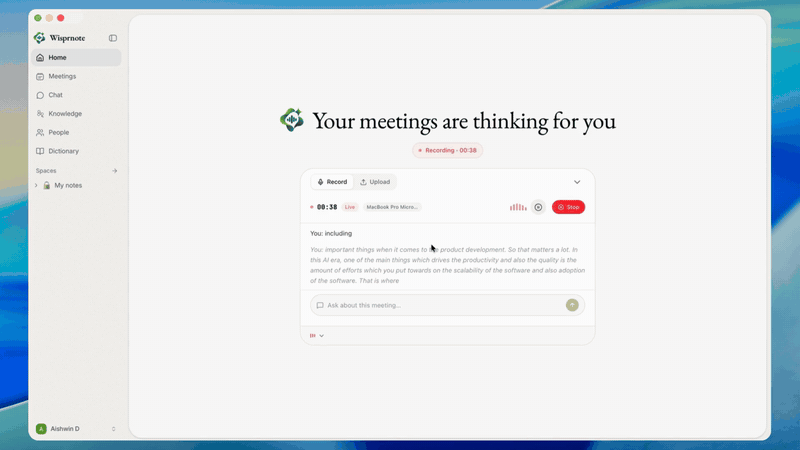

Microphone and system audio, transcribed live, with the timer running.

### 3 · Processing — 1:09

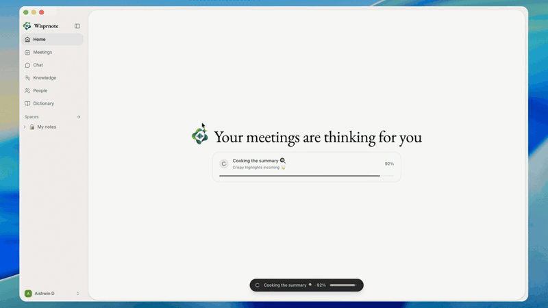

Stop recording and the pipeline says what it is doing, rather than sitting on a spinner.

### 4 · Summary and notes — 1:22

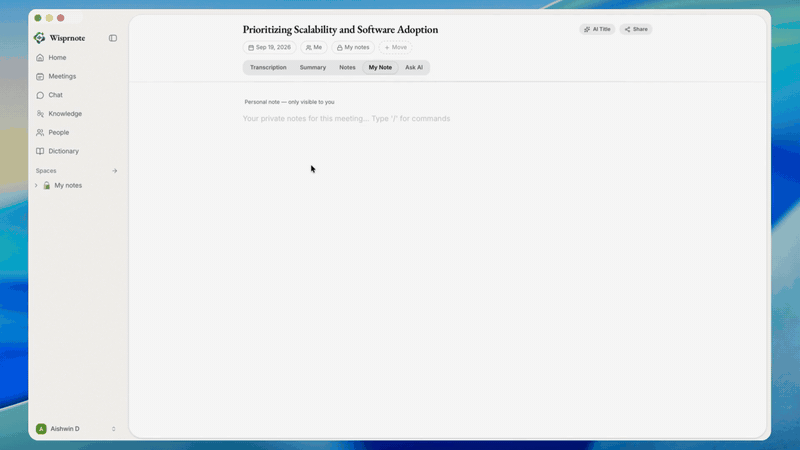

The meeting arrives already written: key summary, discussion points, structured notes —
switchable against the raw transcription.

### 5 · AI visualisation — 2:01

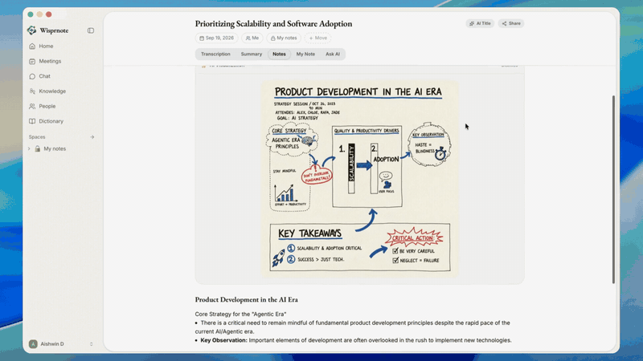

The same notes redrawn as a map, which you can open and dismiss.

### 6 · Ask across meetings — 2:13

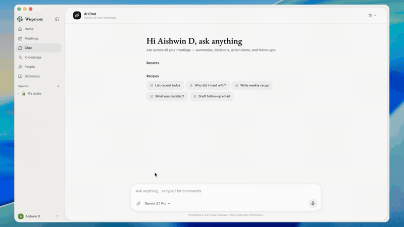

Chat that reads every meeting at once — summaries, decisions, action items, follow-ups — with
the model picker in reach.

### 7 · Knowledge graph — 2:18

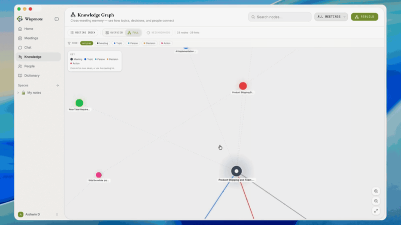

Topics, decisions and people as nodes, edges re-linked as new meetings land, and a click for
any node's detail.

### 8 · People — 3:06

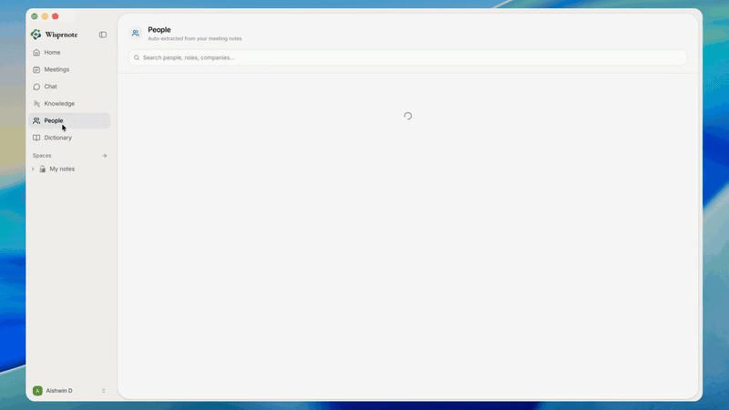

Who was in the room, extracted from the notes themselves rather than typed in.

### 9 · Dictionary — 3:10

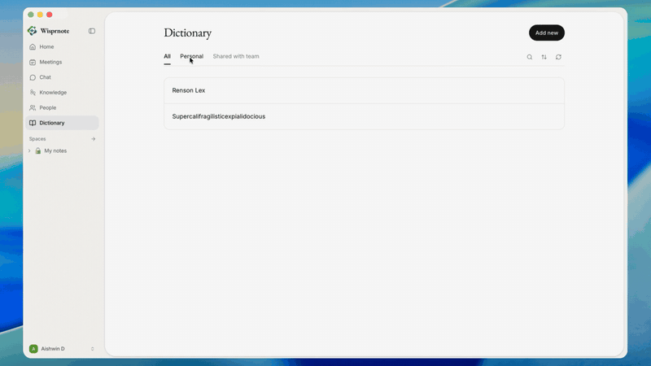

Your own dictionary for names and jargon, shareable with the team.

### 10 · Connectors — 3:16

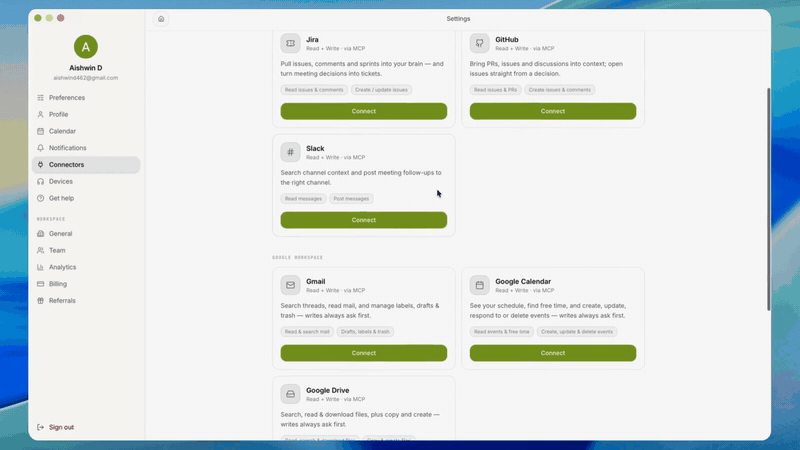

Connect the tools your team already uses. Jira pulls issues, comments and sprints into the
brain, and turns meeting decisions into tickets.

### 11 · My notes — 3:34

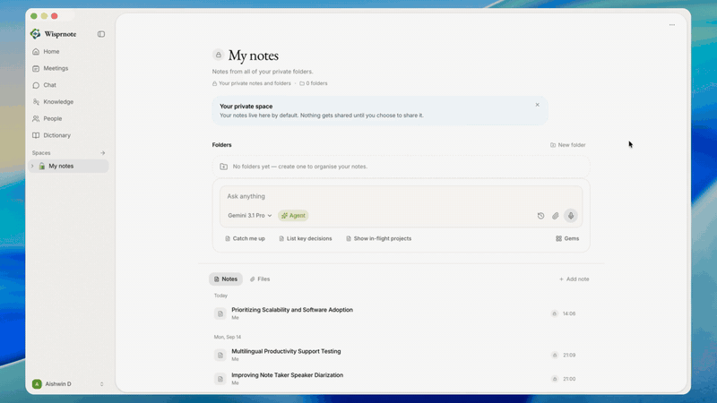

Private notes and folders alongside the meetings, with folders to keep them sorted.

---

Every second of the four-minute demo is covered above, in order. The clips are GIFs cut from
the committed MP4 because GitHub will not play a video out of its own tree: a `<video>` tag
aimed at `docs/demo/` degrades to a dead player, since `raw.githubusercontent.com` serves the
`.mp4` as `application/octet-stream`, which browsers refuse to play. A looping GIF is the one
format GitHub does render inline.

---

## What it does

**It listens.** Wisprnote captures both sides of a meeting — your microphone and the
system audio coming out of Zoom, Meet, or Teams — and transcribes it with speaker
attribution. Nothing needs to be invited to your call; it hears what your Mac hears.

**It understands.** Every meeting is distilled into a summary, notes, decisions, and
action items with owners. This is not one prompt over a transcript: extraction is
structured, and the results are meant to be read by someone who missed the call.

**It remembers.** Meetings are chunked, embedded, and indexed, then woven into a
knowledge graph spanning everything you have ever recorded — topics, people, decisions,
and how they connect. Ask "what did we decide about pricing?" and the answer is drawn
from six months of calls, with citations back to the moment it was said.

**It organises.** Workspaces, spaces, and folders keep meetings sorted; standalone notes
live alongside them. One place, not twelve.

**It acts.** Connectors reach into external systems — Jira and GitHub among them — so
chat can do more than answer. An action item can become a ticket without leaving the
conversation, with a human approving each step.

**It opens up.** A built-in MCP server exposes your meetings, knowledge graph, and notes
to Claude, Cursor, and any other MCP client, so your own AI tools can read the knowledge
base you have been accumulating.

## Architecture

```
┌──────────────── Your Mac ────────────────┐
│  Tauri desktop app (React + TypeScript)  │
│  Rust audio capture (CoreAudio)          │
│    ├─ microphone        (you)            │
│    └─ system audio      (everyone else)  │
└───────────────────┬──────────────────────┘
                    │
        ┌───────────▼────────────┐
        │  Your AWS backend      │  Lambda + API Gateway
        │  (aws/api)             │  Cognito · S3 · CloudFront
        └───────────┬────────────┘
                    │
   ┌────────────────┼─────────────────┬──────────────────┐
   ▼                ▼                 ▼                  ▼
Transcription    LLM              Vector search      Connectors
(Soniox)     (Gemini /         (Turbopuffer)      (Jira, GitHub)
              OpenRouter)
```

The desktop app and audio capture run locally. Transcription, language models, and vector
search are external services you configure with your own keys — see
[SECURITY.md](SECURITY.md) for what that means for confidential meetings.

**Stack:** React 19 · TypeScript · Vite · Tailwind CSS v4 · Tauri 2 · Rust · AWS Lambda ·
Soniox · Gemini / OpenRouter · Turbopuffer

## Install

Full instructions, including every service you need to provision:
**[docs/INSTALL.md](docs/INSTALL.md)**

```bash
git clone https://github.com/migavel508/wisprnote-AI.git
cd wisprnote-AI
npm install
cp .env.example .env.local    # fill in your own keys
npm run tauri:dev
```

Requires **macOS 13.3+**, Node 20+, Rust, and ffmpeg. The UI builds on Linux and Windows,
but system-audio capture is macOS-only — see [Platform support](docs/INSTALL.md#1-platform-support).

## Documentation

| Document | What's in it |
| --- | --- |
| [docs/INSTALL.md](docs/INSTALL.md) | Step-by-step setup, services, troubleshooting |
| [docs/OVERALL_PROJECT_ARCHITECTURE_DEEP_DIVE.md](docs/OVERALL_PROJECT_ARCHITECTURE_DEEP_DIVE.md) | How the whole system fits together |
| [docs/AWS_CLOUD_SERVICES_ARCHITECTURE_DEEP_DIVE.md](docs/AWS_CLOUD_SERVICES_ARCHITECTURE_DEEP_DIVE.md) | The cloud architecture |
| [docs/PRODUCT_END_TO_END.md](docs/PRODUCT_END_TO_END.md) | The product flow, end to end |
| [docs/AGENTIC_CHAT_LOOP.md](docs/AGENTIC_CHAT_LOOP.md) | How chat plans and executes actions |
| [docs/COMPANY_BRAIN.md](docs/COMPANY_BRAIN.md) | The cross-meeting knowledge layer |
| [SECURITY.md](SECURITY.md) | Reporting vulnerabilities, and self-hosting safely |
| [CONTRIBUTING.md](CONTRIBUTING.md) | How to contribute, and the CLA |

## A word on consent

Wisprnote transcribes everything said in a meeting. Recording laws differ by
jurisdiction and many require consent from every participant. Tell people they are being
recorded — it is both the legal position in much of the world and the decent thing to do.

## Licence

Wisprnote is **dual-licensed**.

**[AGPL-3.0](LICENSE)** — free to use, study, modify, and share. You may run it for any
purpose, including commercially and inside a company. If you distribute it, or let others
interact with it over a network, you must release your complete modified source under the
AGPL too (section 13). Internal use with nothing distributed owes nothing further.

**[Commercial licence](LICENSING.md)** — for anyone who cannot meet those conditions:
embedding Wisprnote in a closed-source product, offering it as a hosted service without
publishing your source, white-labelling it, or redistributing it under different terms.
Warranties and support come this way too.

The **Wisprnote** name and logos are trademarks and are *not* covered by the AGPL. Forks
are welcome; forks called Wisprnote are not.

Not sure which applies to you? → **hello@wisprbee.com**

<div align="center">
  <sub>Copyright © 2026 Wisprbee. See <a href="NOTICE">NOTICE</a>.</sub>
</div>
